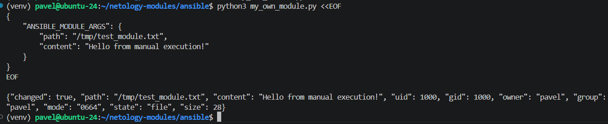
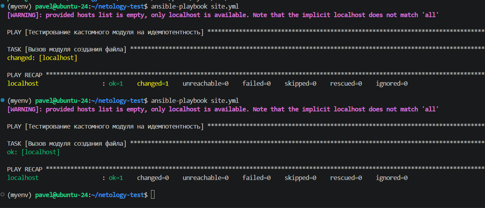
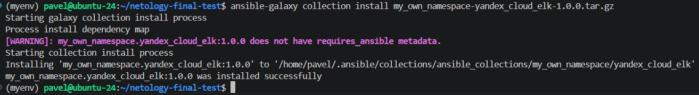

# Домашнее задание к занятию 6 «`Создание собственных модулей`» - `Рыбянцев Павел`

## Ссылки на ресурсы
* 📦 **Репозиторий с коллекцией**: `https://github.com/ShishelM/my_own_collection`
* 🏷 **Финальный тег версии**: `1.0.0`
* 📦 **Прямая ссылка на скачивание архива коллекции (.tar.gz)**: `https://github.com/ShishelM/my_own_collection/blob/main/my_own_namespace-yandex_cloud_elk-1.0.0.tar.gz`

## Описание проделанной работы
1. В виртуальном окружении разработчика Ansible написан собственный модуль `my_own_module.py`, принимающий параметры `path` и `content` и обеспечивающий полную идемпотентность при создании/обновлении файлов.
2. Проведена локальная валидация работоспособности модуля через JSON-поток и Ansible-плейбук (подтверждена идемпотентность: повторный запуск возвращает `changed=0`).
3. Инициализирована официальная Ansible-коллекция `my_own_namespace.yandex_cloud_elk` с помощью утилиты `ansible-galaxy`.
4. Создана роль `file_creator` внутри коллекции, использующая кастомный модуль через его полное имя (FQCN) и содержащая дефолтные параметры в `defaults/main.yml`.
5. Коллекция успешно скомпилирована в дистрибутив `.tar.gz`, установлена локально в систему и протестирована через боевой плейбук.

*Все требуемые скриншоты (пункты 4, 6, 15, 16) прикреплены к отчёту.*

